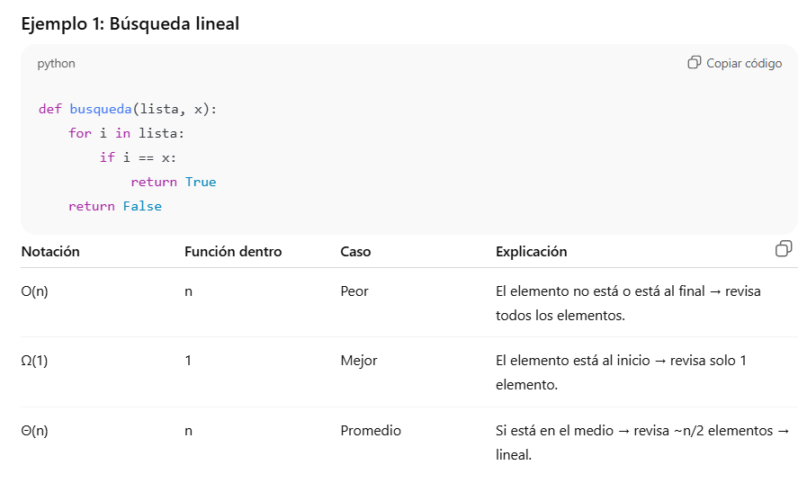
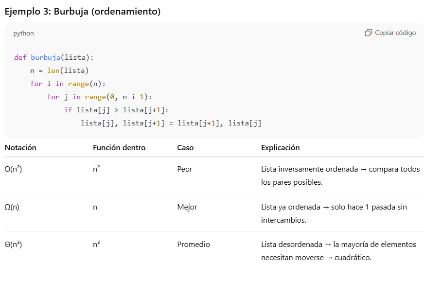

## ¿Qué es un algoritmo y cuándo se dice que un algoritmo resuelve un problema?

Un **algoritmo** es un procedimiento que resuelve un **problema computacional general**, es decir, válido para entradas de tamaño arbitrario `n`.

Un algoritmo se dice que **resuelve un problema** cuando produce una **salida correcta para toda entrada válida**, cumpliendo la especificación del problema.

Además, no basta con que sea correcto, sino que también debe ser **eficiente**, lo cual se analiza mediante **notación asintótica**.  
La corrección suele demostrarse usando **inducción**, debido al uso de bucles o recursión.

---

## ¿Qué significa que un algoritmo sea correcto y cómo se demuestra normalmente su corrección?

Un algoritmo es **correcto** si, para **toda entrada válida**, produce una salida que cumple con la **especificación del problema**.

La corrección se demuestra generalmente mediante **inducción matemática**, ya que los algoritmos suelen utilizar **bucles o recursión**, lo que permite probar que el algoritmo funciona para un **caso base** y que, si funciona para un tamaño `k`, también funciona para `k + 1`.

---

## ¿Por qué no se mide la eficiencia de un algoritmo en segundos y cómo se mide entonces?

La eficiencia de un algoritmo no se mide en **segundos** porque el tiempo real depende del **hardware**, del **lenguaje** y de la **implementación**.

En su lugar, se mide contando el número de **operaciones básicas** que ejecuta el algoritmo en función del tamaño de la entrada `n`.

Este análisis se expresa mediante **notación asintótica**, como **O**, **Ω** y **Θ**, lo que permite comparar algoritmos de manera **independiente de la máquina utilizada**.

---

## Explica qué es la notación O(n) y qué información nos da sobre un algoritmo

**O(n)** es una **cota superior** del tiempo de ejecución de un algoritmo.

Indica que el número de operaciones crece de forma **lineal** con el tamaño de la entrada `n`.

- Si `n` se duplica, el tiempo de ejecución **aproximadamente se duplica**.

# ¿Cuál es la diferencia entre O(n), Ω(n) y Θ(n)?

## 1️⃣ El símbolo (O, Ω, Θ)

- **O →** cota superior → indica el **peor caso** del algoritmo.  
- **Ω →** cota inferior → indica el **mejor caso** del algoritmo.  
- **Θ →** cota ajustada → indica el **crecimiento real/promedio**, cuando mejor y peor caso coinciden.

---

## 2️⃣ Lo que está dentro del paréntesis

Es una **función** (n, n², log n…) que describe **cómo crece el tiempo o espacio** según el tamaño de la entrada \(n\).

**Ejemplos:**

- `O(n)` → “en el peor caso, el tiempo crece linealmente con n”  
- `Ω(1)` → “en el mejor caso, tarda al menos constante, sin importar n”  
- `Θ(n)` → “tiempo promedio crece linealmente con n”

---

## 3️⃣ Resumen rápido

| Notación | Qué significa     | Ejemplo con búsqueda lineal |
|----------|-----------------|----------------------------|
| O(n)     | Peor caso        | Elemento no está en la lista → revisa todos los elementos |
| Ω(1)     | Mejor caso       | Elemento está al inicio → revisa 1 elemento |
| Θ(n)     | Crecimiento exacto | Promedio o cuando mejor y peor caso son similares |

## 🔹 2. Cómo saber qué función poner

1. **Analiza cuántas operaciones hace el algoritmo según n**  
   - `for i in lista:` → puede hacer hasta **n** pasos → `O(n)` en el **peor caso**.  
   - Si solo hace 1 paso en algún escenario → `Ω(1)` en el **mejor caso**.  
   - Si normalmente hace un número intermedio → `Θ(n)` o lo que corresponda.

2. **Considera el tipo de bucles o divisiones**  
   - `for` sobre toda la lista → **lineal**  
   - `for` dentro de otro `for` → **cuadrático**  
   - Dividir en mitades → **logarítmico**
